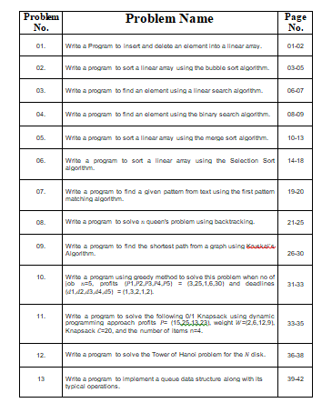

# DATA-STRUCTURE

[![Youtube][youtube-shield]][youtube-url]
[![Facebook][facebook-shield]][facebook-url]
[![Instagram][instagram-shield]][instagram-url]
[![LinkedIn][linkedin-shield]][linkedin-url]

Thanks for visiting my GitHub account!

 A **data structure** is a specialized format for organizing, processing, retrieving and storing data. There are several basic and advanced types of data structures, all designed to arrange data to suit a specific purpose. Data structures make it easy for users to access and work with the data they need in appropriate ways.. [see-more](https://www.geeksforgeeks.org/data-structures/)

A **data structure** is a particular way of organising data in a computer so that it can be used effectively. The idea is to reduce the space and time complexities of different tasks.

|                              |
| :--------------------------: |
|  |

[documentation](https://github.com/learnwithfair/python-documentation)

## Source Code (Download)

[Click Here](https://mega.nz/folder/tL00VSoQ#E4snCVQ3MAKOd-Nss7sWEA)

## Required Software (Download)

- Python, Download-> https://www.python.org/downloads/
- Pycharm (Community), Download-> https://www.jetbrains.com/pycharm/download/?section=windows
- Or, Visual Studio, Download-> https://code.visualstudio.com/download
- For MySQL Database, Download-> https://www.mysql.com/downloads/

## Python Install

Many PCs and Macs will have Python already installed.
To check if you have Python installed on a Windows PC, search in the start bar for Python or run the following on the Command Line (cmd.exe):

```diff
python --version
```

## The Python Command Line

```diff
C:\Users\Your Name>python
```

Or, if the "python" command did not work, you can try "py"

```diff
C:\Users\Your Name>py
```

From there you can write any Python, including our hello world example from earlier in the tutorial

```diff
>>> print("Hello, World!")
```

## Project Features

|                              |
| :--------------------------: |
|  |

## Follow Me

[](https://github.com/learnwithfair) [](https://www.facebook.com/learnwithfair/) [](https://www.instagram.com/learnwithfair/) [](https://www.twiter.com/learnwithfair/) [](https://www.youtube.com/@learnwithfair)

<!-- MARKDOWN LINKS & IMAGES -->

[youtube-shield]: https://img.shields.io/badge/-Youtube-black.svg?style=flat-square&logo=youtube&color=555&logoColor=white
[youtube-url]: https://youtube.com/@learnwithfair
[facebook-shield]: https://img.shields.io/badge/-Facebook-black.svg?style=flat-square&logo=facebook&color=555&logoColor=white
[facebook-url]: https://facebook.com/learnwithfair
[instagram-shield]: https://img.shields.io/badge/-Instagram-black.svg?style=flat-square&logo=instagram&color=555&logoColor=white
[instagram-url]: https://instagram.com/learnwithfair
[linkedin-shield]: https://img.shields.io/badge/-LinkedIn-black.svg?style=flat-square&logo=linkedin&colorB=555
[linkedin-url]: https://linkedin.com/company/learnwithfair
